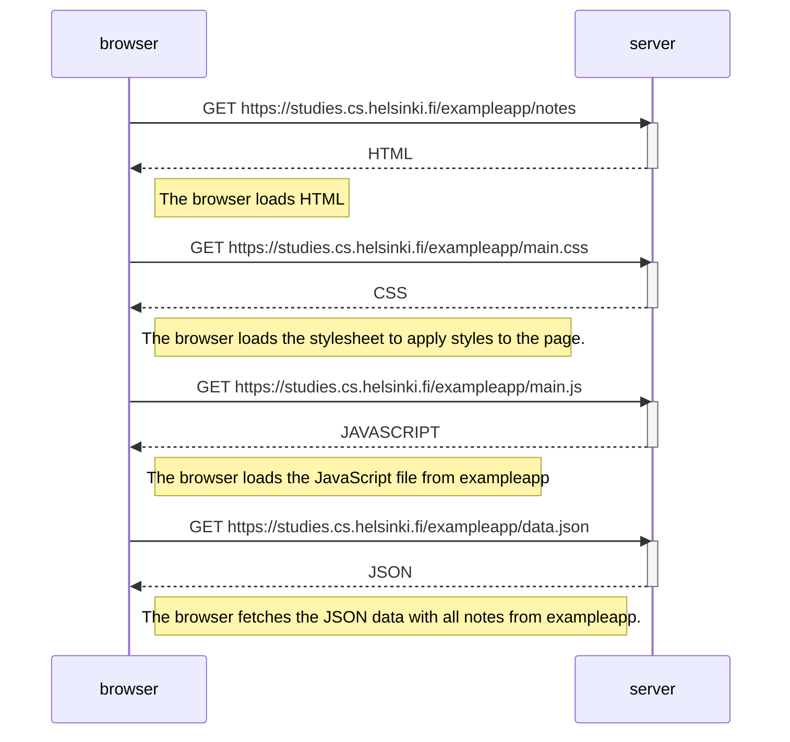

```mermaid
sequenceDiagram
    browser->>server: GET https://studies.cs.helsinki.fi/exampleapp/notes
    activate server
    server-->>browser: HTML
    deactivate server

    Note right of browser: The browser loads HTML 

    browser->>server: GET https://studies.cs.helsinki.fi/exampleapp/main.css
    activate server
    server-->>browser: CSS
    deactivate server

    Note right of browser: The browser loads the stylesheet to apply styles to the page.

    browser->>server: GET https://studies.cs.helsinki.fi/exampleapp/main.js
    activate server
    server-->>browser: JAVASCRIPT
    deactivate server

    Note right of browser: The browser loads the JavaScript file from exampleapp

    browser->>server: GET https://studies.cs.helsinki.fi/exampleapp/data.json
    activate server
    server-->>browser: JSON
    deactivate server

    Note right of browser: The browser fetches the JSON data with all notes from exampleapp. 
```
