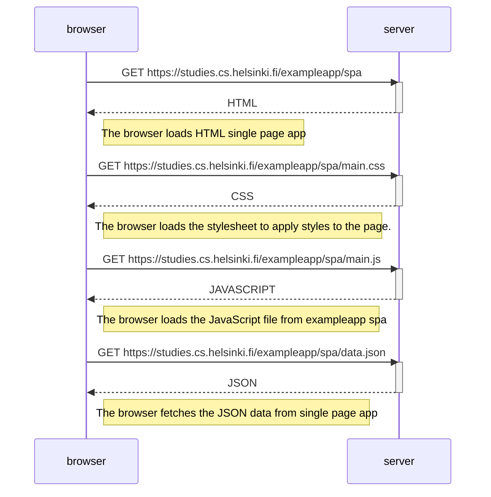

```mermaid
sequenceDiagram
    browser->>server: GET https://studies.cs.helsinki.fi/exampleapp/spa
    activate server
    server-->>browser: HTML
    deactivate server

    Note right of browser: The browser loads HTML single page app

    browser->>server: GET https://studies.cs.helsinki.fi/exampleapp/spa/main.css
    activate server
    server-->>browser: CSS
    deactivate server

    Note right of browser: The browser loads the stylesheet to apply styles to the page.

    browser->>server: GET https://studies.cs.helsinki.fi/exampleapp/spa/main.js
    activate server
    server-->>browser: JAVASCRIPT
    deactivate server

    Note right of browser: The browser loads the JavaScript file from exampleapp spa

    browser->>server: GET https://studies.cs.helsinki.fi/exampleapp/spa/data.json
    activate server
    server-->>browser: JSON
    deactivate server

    Note right of browser: The browser fetches the JSON data from single page app
```
